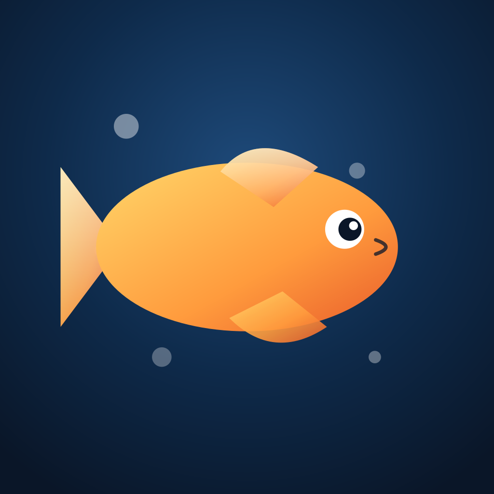
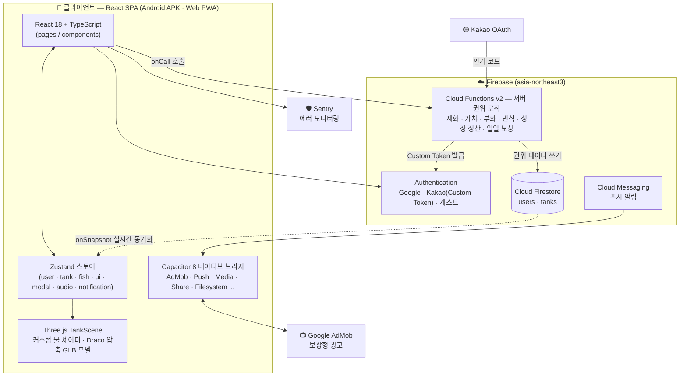

<div align="center">



# AquaWorld 🌊

**내 손안의 살아있는 3D 수족관**

물고기를 키우고, 수조를 꾸미고, 함께 감상하는 힐링 게임

[](https://play.google.com/store/apps/details?id=aquaworld.app)
[](https://www.instagram.com/aquaworld.app)


-3DDC84?style=flat-square)

</div>

---

## 📖 소개

**AquaWorld**는 Three.js 기반의 완전한 3D 수조에서 물고기를 부화시키고, 키우고, 번식시키며 나만의 수족관을 완성해 가는 모바일 힐링 게임입니다. 하나의 React 코드베이스로 **Android 앱(Capacitor)** 과 **웹 PWA**를 동시에 지원합니다.

> 📲 지금 바로 플레이: [Google Play에서 다운로드](https://play.google.com/store/apps/details?id=aquaworld.app)
> 📷 소식 받아보기: 인스타그램 [@aquaworld.app](https://www.instagram.com/aquaworld.app)

---

## ✨ 주요 기능

### 🐠 3D 수조 & 물고기 키우기
- **풀 3D 수조** — 360° 카메라 회전/줌, 커스텀 물 셰이더, 낮·밤·노을 조명 모드
- **물고기 10종 × 4등급** (일반·희귀·에픽·전설) — 클라운피시부터 전설의 실러캔스까지
- **5단계 실시간 성장** — 알 → 치어 → 유어 → 성어 → 대형어, 먹이 주기로 성장 가속
- **돌보기 시스템** — 먹이 주기, 청결도 관리(청소), 물고기 기분(행복/보통/심심) 변화
- **수조 확장** — 8마리에서 최대 20마리까지, 확장 시 수조가 실제로 넓어지는 3D 연출
- **환경 테마 5종** — 산호초 · 심해 · 한국 강 · 아마존 · 우주 (레벨 달성으로 해금)

### 🥚 부화 & 번식
- **알 가챠** — 일반(5분) · 희귀(30분) · 전설(2시간) 알을 인큐베이터에서 부화
- **보상형 광고로 부화 시간 단축** — 광고 시청 시 -5분
- **짝짓기** — 같은 종 성어 2마리를 짝지어 알 획득, 낮은 확률로 상위 등급 종 부화

### 🪸 수조 꾸미기
- 수초 · 바위 · 유목 · 장식물을 자유롭게 **배치/회전/크기 조절**하는 데코 편집 모드
- 꾸미기 **프리셋 3슬롯** 저장/불러오기

### 📖 도감 & 보상
- 수집한 종을 기록하는 **도감**과 수집률 마일스톤 보상 (10% ~ 100%)
- **7일 주기 출석 보상**, 로그인 스트릭
- 튜토리얼 & 일일 미션형 먹이 보상

### 📸 사진 모드
- 수조를 촬영해 프레임 합성 후 **갤러리 저장 & SNS 공유**

### 🛍️ 상점 & 재화
- **진주(Pearl) · 별산호(Star Coral)** 이중 재화 시스템
- 알 · 데코 · 먹이 티켓 구매, 보상형 광고 시청으로 재화 획득

### 🔔 그 외
- **Google · 카카오 소셜 로그인** + 게스트 모드 (기기 로컬 저장)
- **FCM 푸시 알림** — 부화 완료 등 주요 이벤트 알림
- BGM · 효과음 (Howler.js), 오디오 설정 영속화
- 서버 시각 동기화 기반 성장/보상 계산 — **시간 조작 치팅 방지**
- 오프라인 감지, Sentry 에러 모니터링, 인앱 피드백
- 친구 수조 방문 등 소셜 기능 (준비 중)

---

## 🛠️ 기술 스택

### Frontend


### Mobile (Native)


### Backend & Infra


### Auth · Ads · Monitoring · Audio


### Tooling


---

## 🏗️ 아키텍처

### 시스템 구성도



### 핵심 설계 원칙

| 원칙 | 설명 |
|---|---|
| **서버 권위 (Server-Authoritative)** | 재화·아이템·가챠 결과를 바꾸는 **모든 연산은 Cloud Functions에서만** 실행됩니다. 클라이언트의 Firestore 직접 쓰기는 보안 규칙(`firestore.rules`)으로 차단되어 있어 값 조작이 불가능합니다. |
| **단일 코드베이스 멀티 플랫폼** | 하나의 React 코드로 Android 앱(Capacitor)과 웹 PWA를 동시에 빌드합니다. `VITE_TARGET=capacitor` 환경 변수로 타깃별 동작을 분기합니다. |
| **실시간 동기화** | `useFirestoreSync` 훅이 Firestore `onSnapshot` 구독으로 서버 상태를 Zustand 스토어에 실시간 반영합니다. |
| **서버 시각 기준 계산** | 성장·부화·일일 리셋(KST 자정)은 기기 시계가 아닌 서버 시각을 기준으로 정산되어 시간 조작 치팅을 원천 차단합니다. |
| **3D 에셋 파이프라인** | `scripts/`의 생성 스크립트로 물고기·데코 GLB 모델을 만들고 **Draco 압축** 후, 로그인 직후 백그라운드 프리로딩하여 수조 진입 지연을 최소화합니다. |
| **카카오 로그인 플로우** | 카카오 인가 코드 → Cloud Functions에서 토큰 교환 → **Firebase Custom Token** 발급 → `signInWithCustomToken`. 네이티브에서는 딥링크(`aquaworld.app://oauth/kakao`)로 복귀합니다. |

### 디렉터리 구조

```
aqua-world/
├─ src/
│  ├─ pages/          # 라우트 화면 — 수조 · 도감 · 상점 · 친구 · 설정 · 로그인 · 온보딩
│  ├─ components/     # UI 컴포넌트 · 패널 · 모달 (인큐베이터, 번식, 데코 모드, 사진 모드 ...)
│  │  └─ 3d/          # TankScene, WaterShader 등 Three.js 씬
│  ├─ store/          # Zustand 도메인별 스토어 (user · tank · fish · ui · modal · audio · notification)
│  ├─ services/       # firebase(auth · firestore · functions · messaging) · ads · audio · analytics · clock · network
│  ├─ hooks/          # useFirestoreSync(실시간 동기화), useCameraControls(3D 카메라)
│  ├─ utils/          # 성장 · 번식 · 기분 계산, GLB 로더, 사진 합성
│  ├─ constants/      # 게임 밸런스 상수 (성장 시간 · 가챠 확률 · 보상 테이블)
│  └─ types/          # 공용 타입 정의 (Fish · Egg · Tank · User ...)
├─ functions/         # Firebase Cloud Functions — 서버 권위 게임 로직 (gameData · growth)
├─ android/           # Capacitor Android 네이티브 프로젝트
├─ scripts/           # 에셋 파이프라인 (GLB 생성 · Draco 압축 · 아이콘/스플래시 생성)
├─ public/            # 정적 에셋 (models · audio · icons · draco 디코더)
└─ docs/              # 기획서 · 네이티브/결제 연동 가이드
```

---

<div align="center">

**AquaWorld** — 오늘도 내 수조에서 잠깐 쉬어가세요 🐠

[](https://play.google.com/store/apps/details?id=aquaworld.app)
[](https://www.instagram.com/aquaworld.app)

</div>
